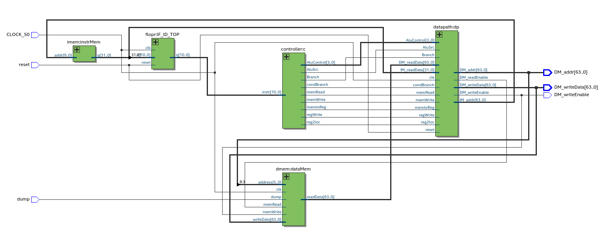
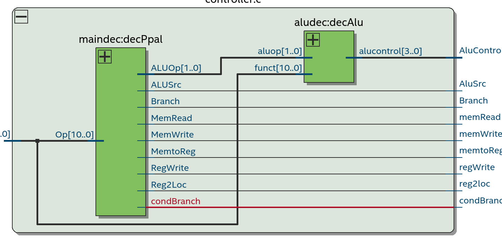
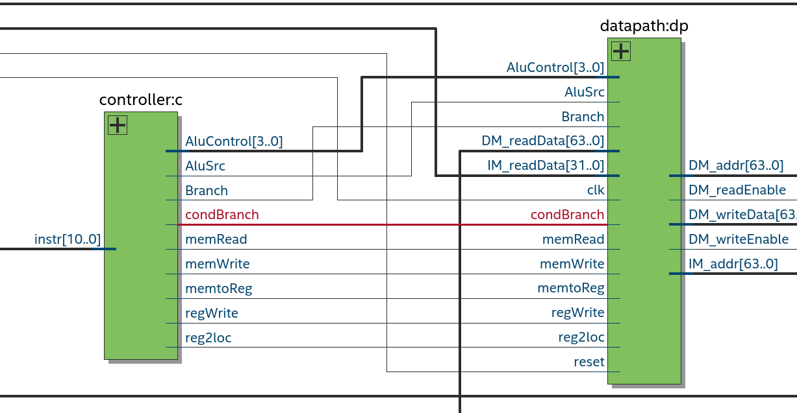
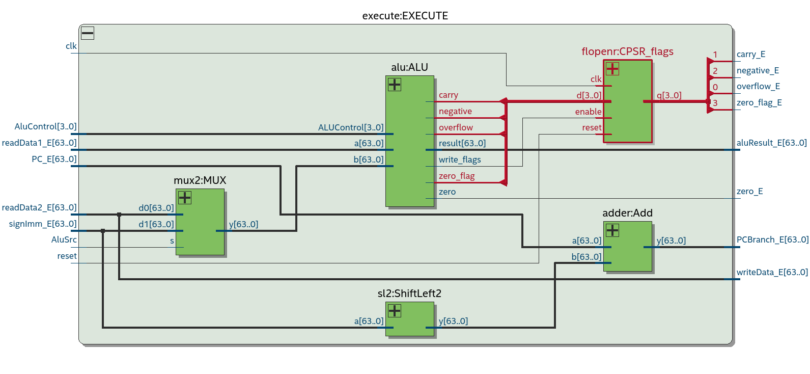
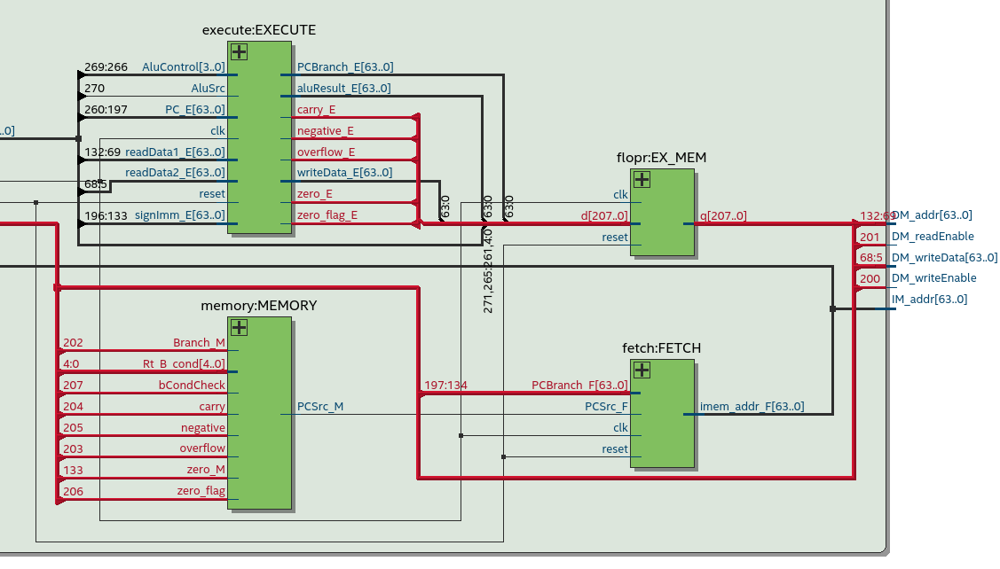
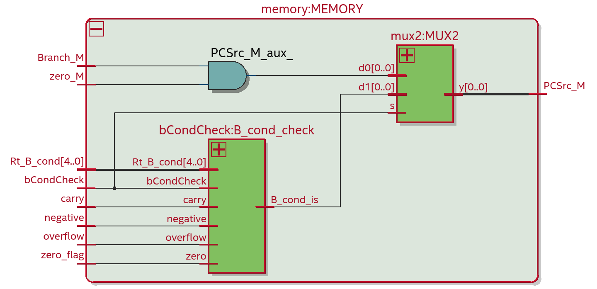

[](https://classroom.github.com/a/NmEzgpEA)

# FaMAF-UNC: Arquitectura de Computadoras 2024

Template del laboratorio 1 para Quartus 20.1 y el dispositivo Cyclone IV: EP4CE22F17C6.
Debe realizarse un fork de este repositorio y el nombre debe corresponderse al asignado por la cátedra.

Directorios:

- módulos: Deben estar TODOS los módulos implementados (no crear otros directorios con módulos)
- test-benchs: Por cada módulo debe existir al menos un test-bench. El archivo debe llamarse con el nombre del módulo + "\_tb".

## Informe

Integrantes:

- Ramiro Lugo Viola
- Matías Viola
- Daián Giménez

### Ejercicio 1

<!--
● Describir brevemente qué modificaciones se introdujeron (en qué entidades y con
qué finalidad). Mostrar el diagrama del nuevo microprocesador, indicando las
señales y entidades agregadas (de ser necesario).
-->

Para desarrollar las instrucciones `ADDI` y `SUBI` se modificaron los módulos:

#### **maindec.sv**

```sv
    logic [8:0] output_signals [0:5] = '{
        9'b0_0_0_1_0_0_0_10,
        9'b0_1_1_1_1_0_0_00,
        9'b1_1_0_0_0_1_0_00,
        9'b1_0_0_0_0_0_1_01,
        9'b0_1_0_1_0_0_0_11, // I-format -> NUEVA LINEA
        9'b0_0_0_0_0_0_0_00
    };
```

> Se agregaron las señales de control para las instrucciones `ADDI` y `SUBI`.

```sv
    casez (Op)
        ...
        // TYPE I
        11'b100_1000_100?, // ADDI
        11'b110_1000_100?: // SUBI
                    res = output_signals[4];
        ...
    endcase
```

> Se agrego que según el opcode de la instrucción se seleccione la señal de control correspondiente.

#### **aludec.sv**

```sv
    ...
    else if((aluop == 2'b11)  & (funct[10:1] == 10'b1001000100)) alucontrol = 4'b0010; //ADDI
    else if((aluop == 2'b11)  & (funct[10:1] == 10'b1101000100)) alucontrol = 4'b0110; //SUBI
    ...
```

> Se asignaron las nuevas señales de `alucontrol` para las instrucciones `ADDI` y `SUBI`.

#### **signext.sv**

```sv
    casez (a[31:21])
        ...
        11'b1001000100?: y = {{52'b0}, a[21:10]};  // I para ADDI
        11'b1101000100?: y = {{52'b0}, a[21:10]};  // I para SUBI
        ...
    endcase
```

> Se modificó el `signext` pueda extender los valores de las instrucciones `ADDI` y `SUBI`.

#### **imem.sv**

```sv
    input logic [9:0] addr
```

> Se modifico el tamaño de la dirección de memoria para que entre el nuevo código.

```sv
    logic [N-1:0] ROM [0:1023] = '{default: 32'b0};
```

> Se modifico el tamaño de la memoria ROM para que entre el nuevo código.
> (Le dejamos bastante espacio para no tener problemas)

<!--
● Mostrar el programa en assembler LEGv8 modificado que se utilizó para verificar el
comportamiento del procesador.
-->

#### Programa en assembler

Programa en assembler para verificar el comportamiento del procesador con las nuevas instrucciones `ADDI` y `SUBI`:

```sv
    .text
    .org 0x0000

    // Test de ADDI y SUBI
    ADD X17, X17, #1 //ADDI
        ADD XZR, XZR, XZR
        ADD XZR, XZR, XZR
    STUR X17, [X0, #200] // MEM :0x12
    SUB X18, X18, #1 //SUBI
        ADD XZR, XZR, XZR
        ADD XZR, XZR, XZR
    STUR X18, [X0, #208] // MEM :0X11

    // Continuación del codigo anterior
    STUR X1, [X0, #0] // MEM 0:0x1
    STUR X2, [X0, #8] // MEM 1:0x2
    STUR X3, [X16, #0] // MEM 2:0x3
    ADD X3, X4, X5
        ADD XZR, XZR, XZR
        ADD XZR, XZR, XZR
    STUR X3, [X0, #24] // MEM 3:0x9
    SUB X3, X4, X5
        ADD XZR, XZR, XZR
        ADD XZR, XZR, XZR
    STUR X3, [X0, #32] // MEM 4:0xFFFFFFFFFFFFFFFF
    SUB X4, XZR, X10
        ADD XZR, XZR, XZR
        ADD XZR, XZR, XZR
    STUR X4, [X0, #40] // MEM 5:0xFFFFFFFFFFFFFFF6
    ADD X4, X3, X4
        ADD XZR, XZR, XZR
        ADD XZR, XZR, XZR
    STUR X4, [X0, #48] // MEM 6:0xFFFFFFFFFFFFFFF5
    SUB X5, X1, X3
        ADD XZR, XZR, XZR
        ADD XZR, XZR, XZR
    STUR X5, [X0, #56] // MEM 7:0x2
    AND X5, X10, XZR
        ADD XZR, XZR, XZR
        ADD XZR, XZR, XZR
    STUR X5, [X0, #64] // MEM 8:0x0
    AND X5, X10, X3
        ADD XZR, XZR, XZR
        ADD XZR, XZR, XZR
    STUR X5, [X0, #72] // MEM 9:0xA
    AND X20, X20, X20
        ADD XZR, XZR, XZR
        ADD XZR, XZR, XZR
    STUR X20, [X0, #80] // MEM 10:0x14
    ORR X6, X11, XZR
        ADD XZR, XZR, XZR
        ADD XZR, XZR, XZR
    STUR X6, [X0, #88] // MEM 11:0xB
    ORR X6, X11, X3
        ADD XZR, XZR, XZR
        ADD XZR, XZR, XZR
    STUR X6, [X0, #96] // MEM 12:0xFFFFFFFFFFFFFFFF
    LDUR X12, [X0, #0]
        ADD XZR, XZR, XZR
        ADD XZR, XZR, XZR
    ADD X7, X12, XZR
        ADD XZR, XZR, XZR
        ADD XZR, XZR, XZR
    STUR X7, [X0, #104] // MEM 13:0x1
    STUR X12, [X0, #112] // MEM 14:0x1
    ADD XZR, X13, X14
    STUR XZR, [X0, #120] // MEM 15:0x0
    CBZ X0, L1
        ADD XZR, XZR, XZR
        ADD XZR, XZR, XZR
        ADD XZR, XZR, XZR
    STUR X21, [X0, #128] // MEM 16:0x0 (si falla CBZ =21)
L1:
    STUR X21, [X0, #136] // MEM 17:0x15
    ADD X2, XZR, X1
        ADD XZR, XZR, XZR
        ADD XZR, XZR, XZR
L2:
    SUB X2, X2, X1
    ADD X24, XZR, X1
        ADD XZR, XZR, XZR
        ADD XZR, XZR, XZR
    STUR X24, [X0, #144] // MEM 18:0x1 y MEM 19=0x1
    ADD X0, X0, X8
    CBZ X2, L2
        ADD XZR, XZR, XZR
        ADD XZR, XZR, XZR
        ADD XZR, XZR, XZR
    STUR X30, [X0, #144] // MEM 20:0x1E
    ADD X30, X30, X30
    SUB X21, XZR, X21
        ADD XZR, XZR, XZR
    ADD X30, X30, X20
        ADD XZR, XZR, XZR
        ADD XZR, XZR, XZR
    LDUR X25, [X30, #-8]
    ADD X30, X30, X30
        ADD XZR, XZR, XZR
        ADD XZR, XZR, XZR
    ADD X30, X30, X16
        ADD XZR, XZR, XZR
        ADD XZR, XZR, XZR
    STUR X25, [X30, #-8] // MEM 21:0xA (= MEM 9)
finloop:
    CBZ XZR, finloop
```

### Ejercicio 2

<!--
● Describir brevemente qué modificaciones se introdujeron (en qué módulos y con qué
  finalidad). Mostrar el diagrama del nuevo microprocesador, indicando las señales y
  módulos agregados.
-->

El diagrama del nuevo micro quedo de la siguiente forma:



Para desarrollar las instrucciones `B.cond`, `ADDS`, `SUBS`, `ADDIS` y `SUBIS` se modificaron los módulos:

#### **aludec.sv**

En este modulo agregamos los casos necesarios para las nuevas instrucciones, agregando lo siguiente:

```sv
    always_comb
        ...
        else if (aluop == 2'b01) alucontrol = 4'b0111;     // CBZ or B.cond
        else if((aluop == 2'b11)  & (funct[10:1] == 10'b1011000100)) alucontrol = 4'b1010; //ADDIS
        else if((aluop == 2'b11)  & (funct[10:1] == 10'b1111000100)) alucontrol = 4'b1110; //SUBIS
        else if((aluop == 2'b10)  & (funct == 11'b10101011000)) alucontrol = 4'b1010; //ADDS
        else if((aluop == 2'b10)  & (funct == 11'b11101011000)) alucontrol = 4'b1110; //SUBS
```

#### **maindec.sv**

Se manejan los siguientes nuevos casos para el `casez`:

```sv
            11'b101_0101_1000, //ADDS
            11'b111_0101_1000, //SUBS
            11'b100_0101_1000,
            11'b110_0101_1000,
            11'b100_0101_0000,
            11'b101_0101_0000: res = output_signals[0];
            // TYPE I
            11'b101_1000_100?, // ADDIS
            11'b1111_000_100?, // SUBIS
            11'b100_1000_100?,
            11'b110_1000_100?:
                    res = output_signals[4];
            // B.cond
            11'b010_1010_0???: res = output_signals[5];
```

Ademas agregamos una nueva señal de salida `output logic condBranch`, quedando las señales de la siguiente manera:

```sv
    logic [9:0] output_signals [0:6] = '{
        10'b0_0_0_1_0_0_0_0_10, // R-format
        10'b0_1_1_1_1_0_0_0_00, // LDUR
        10'b1_1_0_0_0_1_0_0_00, // STUR
        10'b1_0_0_0_0_0_1_0_01, // CBZ
        10'b0_1_0_1_0_0_0_0_11, // I-format
        10'b0_0_0_0_0_0_1_1_01, // B.cond
        10'b0_0_0_0_0_0_0_0_00  // default
    };

    logic [9:0] res;
    assign {Reg2Loc,
            ALUSrc,
            MemtoReg,
            RegWrite,
            MemRead,
            MemWrite,
            Branch,
            condBranch,
            ALUOp } = res;
```

#### **controller.sv**

Simplemente se adapto agregándole la señal: `output logic condBranch`. La cual sale de `maindec` como se menciono anteriormente.



#### **processor_arm.sv**

Simplemente se modifico para conectar la nueva señal `condBranch` que sale del `controller` al `datapath`.



#### **signext.sv**

Este modulo se modifico para manejar correctamente todos los casos, agregando los siguientes:

```sv
    11'b010_1010_0???: y = {{45{a[23]}}, a[23:5]};         // B.cond
    11'b1011000100?: y = {{52'b0}, a[21:10]};              // I for ADDIS
    11'b1111000100?: y = {{52'b0}, a[21:10]};              // I for SUBIS
```

#### **alu.sv**

Ahora la alu tiene los siguientes nuevos outputs logic: **zero_flag**, **negative**, **carry** y **overflow**, **write_flags**.

Ademas se modifico como se hace la suma y la resta para setear las flags, quedando así:

```sv
    4'b?010: begin // SUMA
        aux_result = a + b;
        if (write_flags === '1) begin // Si seta flags, setamos si hay overflow.
            overflow = (((a >= 0) && (b >= 0) && (aux_result < 0)) ||
                        ((a < 0)  && (b < 0) && (aux_result >= 0)));
        end
    end
    4'b?110: begin // RESTA
        // Resta utilizando complemento a dos
        logic [N-1:0] complemento_b;        // Almacena el complemento a dos de b
        complemento_b = ~b + 1'b1;          // Calcular complemento a dos de b
        aux_result = a + complemento_b;     // Resta como suma de complemento a dos

        if (write_flags === '1) begin // Si seta flags, setamos si hay overflow.
            overflow = (((a >= 0) && (b < 0) && (aux_result < 0)) ||
                        ((a < 0) && (b >= 0) && (aux_result >= 0)));
        end
    end
```

Teniendo en cuenta que `write_flags` se detecta por:

```sv
    write_flags = ALUControl[3];
```

Finalmente se setean el resto de las flags de la siguiente forma:

```sv
    if (write_flags === 1) begin // Si seta flags las setamos
        // Bandera de carry
        carry = (aux_result[N] === '1);
        // Bandera Zero
        zero_flag = (aux_result[N-1:0] === '0) ? 1'b1 : 1'b0;
        // Bandera Negative (El bit más significativo (MSB) indica el signo)
        negative = aux_result[N-1];
    end
```

Notar que el resultado se encuentra en `aux_result`:

```sv
logic [N:0] aux_result; // Tiene un bit de mas para detectar al carry
```

y debido a esto se modifico también al final lo siguiente:

```sv
    zero = (aux_result[N-1:0] === '0) ? 1'b1 : 1'b0;
    result = aux_result[N-1:0];
```

#### **flopenr.sv**

Se creo este nuevo modulo que usamos en el registro de flags que a diferencia del otro `flopr` ya que teníamos, este setea solo si la señal de `enable` esta encendida.

#### **execute.sv**

Se modifico para agregarle y conectar las señales de flags que se setean en la alu que son guardadas en `CPSR_flags` usando el modulo `flopenr`. Ademas fue necesario traerle el `clk` y el `reset` para el modulo `flopenr`. Quedando:

```sv
    flopenr   #(4)      CPSR_flags (.clk(clk),
                                    .reset(reset),
                                    .enable(write_flags_ALU),
                                    .d({
                                        zero_flag_ALU,
                                        negative_ALU,
                                        carry_ALU,
                                        overflow_ALU
                                    }),
                                    .q({
                                        zero_flag_E,
                                        negative_E,
                                        carry_E,
                                        overflow_E
                                    }));
```

Finalmente las agregamos que justamente estas señales salgan del modulo por `zero_flag_E, negative_E, carry_E, overflow_E`.

El diagrama de este modulo quedo de la siguiente forma:



#### **datapath.sv**

Este modulo se modifico para conectar las señales de flags que salen del `execute` (estas señales son las que están guardadas en `CPSR_flags`, las otras quedaron igual) al modulo de `memory`. Usando los registros del pipeline para que las señales viajen correctamente.

Ademas hicimos que la señal `condBranch` viaje correctamente por el pipeline.

El diagrama de este modulo quedo de la siguiente forma:



#### **memory.sv**

Como mencionamos anteriormente agregamos nuevas entradas a este modulo, específicamente:
`input logic Branch_M, zero_M, zero_flag, negative, overflow, carry, bCondCheck`
Y lo modificamos agregando el nuevo modulo `bCondCheck` y un mux para mantener la señal de `Branch` o la de `condBranch` según corresponda. Quedando de la siguiente forma:

```sv
    logic B_cond_is;
    logic PCSrc_M_aux_;

    bCondCheck B_cond_check(
        .zero(zero_flag),
        .negative(negative),
        .carry(carry),
        .overflow(overflow),
        .bCondCheck(bCondCheck),
        .Rt_B_cond(Rt_B_cond),
        .B_cond_is(B_cond_is)
    );

    assign PCSrc_M_aux_ = Branch_M && zero_M;
    mux2 #(1) MUX2 (.d0(PCSrc_M_aux_), .d1(B_cond_is), .s(bCondCheck), .y(PCSrc_M));
```

El diagrama de este modulo quedo de la siguiente forma:



#### **bCondCheck.sv**

Este es un nuevo modulo encargado de chequear las condiciones del `B.cond` quedando de la siguiente forma:

```sv
module bCondCheck (
    input logic zero,
    input logic negative,
    input logic carry,
    input logic overflow,
    input logic bCondCheck,
    input logic [4:0] Rt_B_cond,
    output logic B_cond_is);

    always_comb begin
        B_cond_is = 0;
        if (bCondCheck) begin
            casez (Rt_B_cond)
                5'b00000: B_cond_is = zero;                                             //B.EQ
                5'b00001: B_cond_is = (zero === 0);                                     //B.NE
                5'b00010: B_cond_is = carry;                                            //B.HS
                5'b00011: B_cond_is = (carry === 0);                                    //B.LO
                5'b00100: B_cond_is = negative;                                         //B.MI
                5'b00101: B_cond_is = (negative === 0);                                 //B.PL
                5'b00110: B_cond_is = overflow;                                         //B.VS
                5'b00111: B_cond_is = (overflow === 0);                                 //B.VC
                5'b01000: B_cond_is = ((zero === 0) && carry);                          //B.HI
                5'b01001: B_cond_is = ~((zero === 0) && carry);                         //B.LS
                5'b01010: B_cond_is = (negative === overflow);                          //B.GE
                5'b01011: B_cond_is = (negative !== overflow);                          //B.LT
                5'b01100: B_cond_is = ((negative === 0) && (negative === overflow));    //B.GT
                5'b01101: B_cond_is = ~((negative === 0) && (negative === overflow));   //B.LE
                default: B_cond_is = 0;
            endcase
        end
    end

endmodule
```

#### **imem.sv** y **imem.txt**

Se modifico la `imem` con el fin de poder cargarla a partir del archivo `imem.txt`.

#### Programa en assembler

<!--
● Escribir una sección de código assembler, donde se pruebe el funcionamiento de las
  nuevas instrucciones y se verifique que las que ya estaban implementadas
  continúen funcionando correctamente. Los resultados obtenidos al ejecutar cada una
  de las instrucciones deben guardarse en la memoria de datos. Mostrar el programa
  en assembler LEGv8 modificado que se utilizó para verificar el comportamiento del
  procesador y el contenido de memoria al finalizar su ejecución.
-->

<!-- TODO: Completar ... -->
